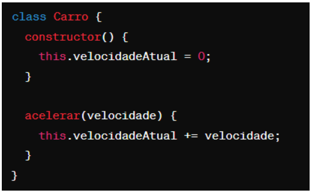
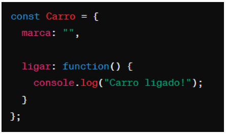

# Instruções

- Faça uma cópia deste arquivo .md para um repositório próprio
- Resolva as 6 questões objetivas assinalando a alternativa correta
- Resolva as 4 questões dissertativas escrevendo no próprio arquivo .md
  - lembre-se de utilizar as estruturas de código como `` esta aqui com `  `` ou

````javascript
//esta aqui com ```
let a = "olá";
let b = 10;
print(a);
````

- Resolva as questões com uso do Visual Studio Code ou ambiente similar.
- Teste seus códigos antes de trazer a resposta para cá.
- Cuidado com ChatGPT e afins: entregar algo só para ganhar nota não faz você aprender e ficar mais inteligente. Não seja dependente da máquina!
- ao final, publique seu arquivo lista_01.md com as respostas em seu repositório, e envie o link pela Adalove.

# Questões objetivas

**1)** O que o código a seguir faz?


Escolha a opção que responde corretamente:

a) Imprime os números pares de 1 a 10. [X]

b) Imprime os números ímpares de 1 a 10.

c) Imprime os números pares de 2 a 10.

d) Imprime os números ímpares de 2 a 10.

---

**2)** Identificar a linha que falta no código para criar uma classe Veiculo com atributo marca, e uma classe Carro que herda de Veiculo com um método ligar().


No lugar onde está escrito “// linha” qual das opções abaixo deve estar para funcionar corretamente o código?

A) let carro = new Carro("Toyota"); [X]

B) let ligar = new ligar("Toyota");

C) class Moto extends Veiculo {};

D) carro1.ligar();

---

**3)** Qual é o valor de resultado após a execução deste código?


Escolha a opção que responde corretamente:

A) 18 [X]

B) 16

C) 14

D) 12

---

**4)** Como você criaria um método `acelerar()` em uma classe `Carro`, que recebe um parâmetro `velocidade` e o adiciona a um atributo `velocidadeAtual`?

A)  [X]

B) 

C) 

D) 

---

**5)** Qual a forma correta de definir uma classe Carro em JavaScript, com um método ligar() e um atributo marca?

A)  [X]

B) 

C) 

D) 

---

**6)** Observe o código abaixo:


Qual será a saída do código acima?

A) "Olá, meu nome é João. Olá, meu nome é Maria." [X]

B) "Olá, meu nome é ."

C) "João Maria"

D) "undefined undefined"

---

# Questões dissertativas

**7)** Vamos criar um programa em JavaScript para entender classes, métodos e atributos!
Classe Animal:

- Crie uma classe chamada Animal.
- Adicione dois atributos: nome e idade.
- Adicione um método chamado descrever() na classe Animal.
  - Este método deve exibir no console uma descrição do animal com seu nome e idade.

Criando e manipulando Animais:

- Crie dois objetos da classe Animal: um chamado "cachorro" e outro "gato", com idades distintas.
- Para cada animal, chame o método descrever() para ver a descrição no console.

Dica: Utilize `console.log()` para exibir as informações!

```javascript
// Criando a classe Animal
class Animal {
  // Construtor para inicializar os atributos nome e idade
  constructor(nome, idade) {
    this.nome = nome;
    this.idade = idade;
  }

  // Método para descrever o animal
  descrever() {
    console.log(`O animal ${this.nome} tem ${this.idade} anos.`);
  }
}

// Criando os objetos cachorro e gato
const cachorro = new Animal("Rex", 5);
const gato = new Animal("Miau", 3);

// Chamando o método descrever para cada animal
cachorro.descrever(); // Saída: O animal Rex tem 5 anos.
gato.descrever(); // Saída: O animal Miau tem 3 anos.
```

---

**8)** Nos últimos dias tivemos a oportunidade de ter contato com Programação Orientada a Objetos, e tivemos contato com o tema "herança". Herança é um princípio de orientação a objetos, que permite que classes compartilhem atributos e métodos. Ela é usada na intenção de reaproveitar código ou comportamento generalizado ou especializar operações ou atributos. Então vamos praticar esse conteúdo nessa questão.
Vamos criar um programa em JavaScript para entender classes, métodos, atributos e herança!

Classe Animal:

- Crie uma classe chamada Animal.
- Adicione dois atributos: nome e idade.
- Adicione um método descrever() que exiba no console uma descrição do animal com seu nome e idade.

Classe Gato (Herda de Animal):

- Crie uma classe chamada Gato que herda da classe Animal.
- Adicione um atributo extra cor específico para gatos.
- Adicione um método miar() que exiba no console o som que um gato faz.

Criando Animais:

- Crie dois objetos da classe Animal: um chamado cachorro e outro gato, com idades distintas.
- Para o gato, também defina a cor.

Chamando os Métodos:

- Para cada animal, chame o método descrever() para ver a descrição no console.
- Para o gato, chame o método miar() para "ouvir" o som que ele faz (é também para ver o som no console).

Dica: Utilize console.log() para exibir as informações!

```javascript
// Criando a classe base Animal
class Animal {
  constructor(nome, idade) {
    this.nome = nome;
    this.idade = idade;
  }

  descrever() {
    console.log(`O animal ${this.nome} tem ${this.idade} anos.`);
  }
}

// Criando a classe Gato que herda de Animal
class Gato extends Animal {
  constructor(nome, idade, cor) {
    super(nome, idade); // Chama o construtor da classe pai (Animal)
    this.cor = cor; // Atributo específico de Gato
  }

  miar() {
    console.log(`${this.nome} faz: Miau miau!`);
  }
}

// Criando os objetos
const cachorro = new Animal("Rex", 5);
const gato = new Gato("Miau", 3, "preto");

// Chamando os métodos
cachorro.descrever(); // Saída: O animal Rex tem 5 anos.
gato.descrever(); // Saída: O animal Miau tem 3 anos.
gato.miar(); // Saída: Miau faz: Miau miau!
```

---

**9)** Vamos criar um programa em JavaScript para somar notas!

Classe SomadorDeNotas:

- Crie uma classe chamada SomadorDeNotas.
- Adicione um atributo total inicializado com 0 para armazenar a soma das notas.

Método adicionarNota:

- Adicione um método chamado adicionarNota(nota) na classe SomadorDeNotas.
- Este método deve receber um parâmetro nota e somá-lo ao atributo total.

Criando o Somador e Adicionando Notas:

- Crie um objeto da classe SomadorDeNotas, chamado somador.
- Utilize o método adicionarNota(nota) para adicionar algumas notas ao somador.

Chamando o Método para Ver o Total:

- Após adicionar todas as notas, chame um método verTotal() para exibir o total das notas adicionadas.

Dica: Utilize console.log() para exibir as informações!

```javascript
// Criando a classe SomadorDeNotas
class SomadorDeNotas {
  constructor() {
    this.total = 0; // Atributo para armazenar a soma, inicializado em 0
  }

  // Método para adicionar uma nota ao total
  adicionarNota(nota) {
    this.total += nota;
  }

  // Método para exibir o total
  verTotal() {
    console.log(`O total das notas é: ${this.total}`);
  }
}

// Criando o objeto somador
const somador = new SomadorDeNotas();

// Adicionando notas
somador.adicionarNota(8);
somador.adicionarNota(7.5);
somador.adicionarNota(9);

// Exibindo o total
somador.verTotal(); // Saída: O total das notas é: 24.5
```

---

**10)** Imagine que você está criando um programa em JavaScript para uma escola. Neste programa, existem diferentes tipos de funcionários, cada um com suas próprias características. Considere as seguintes classes:

Funcionário:

- atributo: Nome
- atributo: Idade
- atributo: Salário base
- método: calcularSalario() - Este método calcula o salário total do funcionário. Para cada tipo de funcionário, o cálculo será diferente.

Professor (herança de Funcionário):

- atributo: Disciplina
- atributo: Horas de aula por semana
- método: calcularSalario() - Para calcular o salário do professor, multiplicamos suas horas de aula pelo valor da hora/aula.

Agora, sua tarefa é escrever um código em JavaScript que crie as classes Funcionário e Professor, com suas características e métodos descritos acima. Depois de criar as classes, crie:

- Dois objetos do tipo Professor com informações fictícias.
- Para cada objeto, chame o método calcularSalario() e mostre o salário calculado no console.

```javascript
// Classe base Funcionário
class Funcionario {
  // Construtor com os atributos básicos de um funcionário
  constructor(nome, idade, salarioBase) {
    this.nome = nome; // Nome do funcionário
    this.idade = idade; // Idade do funcionário
    this.salarioBase = salarioBase; // Salário base inicial
  }

  calcularSalario() {
    return this.salarioBase;
  }
}

// Classe Professor que herda de Funcionario
class Professor extends Funcionario {
  // Construtor com atributos adicionais específicos do professor
  constructor(
    nome,
    idade,
    salarioBase,
    disciplina,
    horasPorSemana,
    valorHoraAula
  ) {
    super(nome, idade, salarioBase); // Chama o construtor da classe pai
    this.disciplina = disciplina; // Disciplina que o professor ensina
    this.horasPorSemana = horasPorSemana; // Horas de aula por semana
    this.valorHoraAula = valorHoraAula; // Valor da hora/aula
  }

  // Sobrescrevendo o método calcularSalario para o cálculo específico de professores
  calcularSalario() {
    const salarioTotal = this.horasAula * this.valorHoraAula; // Cálculo do salário = horas de aula * valor da hora/aula

    return salarioTotal; // Retorna o valor calculado
  }
}

// Criando dois objetos do tipo Professor
const professor1 = new Professor("João", 40, 2000, "Matemática", 20, 50);
const professor2 = new Professor("Maria", 35, 2000, "História", 15, 50);

// Chamando o método calcularSalario para cada professor

console.log(
  `O salário de ${professor1.nome}, professor de ${
    professor1.disciplina
  }, é: R$${professor1.calcularSalario()}`
); // Saída: O salário de João, professor de Matemática, é: R$1000
console.log(
  `O salário de ${professor2.nome}, professor de ${
    professor2.disciplina
  }, é: R$${professor2.calcularSalario()}`
); // Saída: O salário de Maria, professor de História, é: R$750
```
